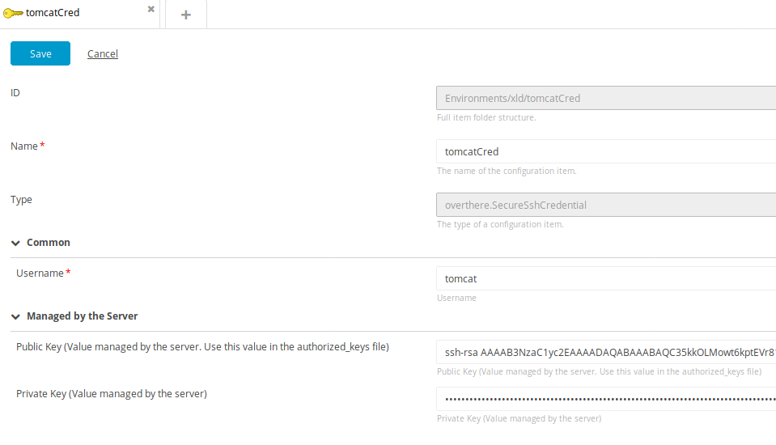
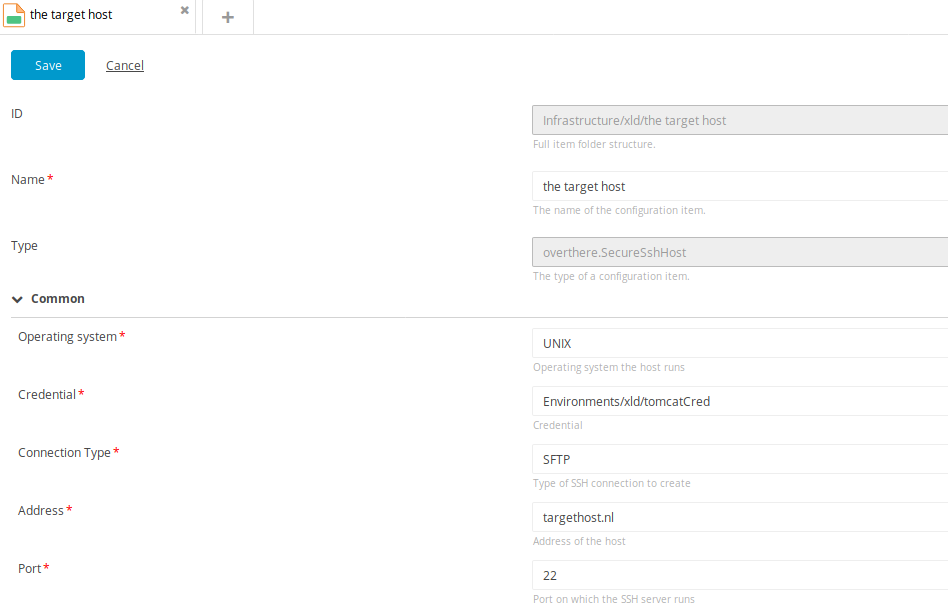
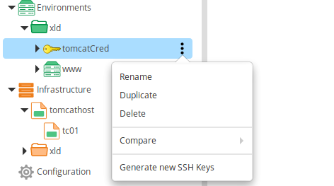

# Secure SSH Credential plugin #

# Overview #

The secure-ssh-credential plugin allows you to define ssh credentials of the type `overthere.SecureSshCredential` under the Environments node.
This credential can be used in the Infrastructure type `overthere.SecureSshHost`.

# Requirements #

* **Deployit requirements**
	* **XL Deploy**: version 5.0.0+

# Installation on the XL Deploy server by administrators #

Place the plugin JAR file into your `SERVER_HOME/plugins` directory.

## Create a Secure SSH Credential

In the `Environments` node in XLDeploy choose for > `new` > `overthere` > `SecureSshCredential`

**Do not overwrite the fields which are managed by the server.**

| User Managed Fields | Description                                                                             |
|-------------------- | --------------------------------------------------------------------------------------- |
| Name                | Name of the credential                                                                  |
| Username            | User with which the SSH Connection is made(e.g. deployit) as in `ssh <user>@<hostname>` |

| Server Managed Fields | Description, these values are filled after generation of the SSH key pair      |
|---------------------- | ------------------------------------------------------------------------------ |
| Public Key            | Public SSH key, this value should be used in the `~/.ssh/authorized_keys` file |
| Private Key           | Encrypted Private SSH key                                                      |

The ssh keys are generated with a key size of 2048 bits.

You can create a SSH Credential per cluster of servers. For instance for all servers in a development phase or for a sub-application.

## Create a Secure SSH Host

In the `Infrastructure` node in XLDeploy choose for > `new` > `overthere` > `SecureSshHost`

Almost all fields are the same as in `overthere.SshHost` except the Credential. This can be one of the `overthere.SecureSshCredentials` 

# Controltask #

On the `overthere.SecureSshCredential` there is a controltask which generates the SSH key pair.

# Usage

1. Create a Secure Ssh Credential in the Environments node and save it.
 * As an example, make a credential per functional environment or cluster of target hosts.
2. Run the Task `Generate new SSH Keys` on the `SecureSshCredential`.
3. Open the `SecureSshCredential` again and copy the public key value.
4. Create as `Infrastructure` all target hosts with `overthere.SecureSshHost` type and with the created credential.
5. Put the public key value of the credential on the target hosts in the file `/home/<Username>/.ssh/authorized_keys`
6. Depending on the security configuration of the server it is probably necessary to do some extra steps.

**The simplest way to do this all is using a tool like Ansible.**

  